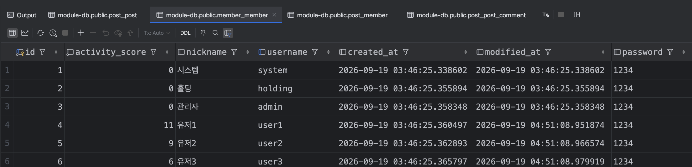
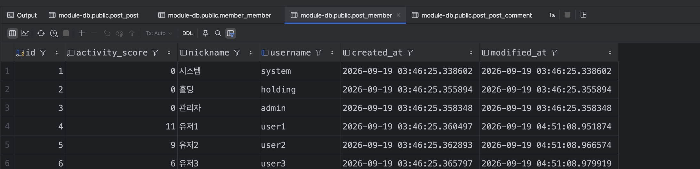
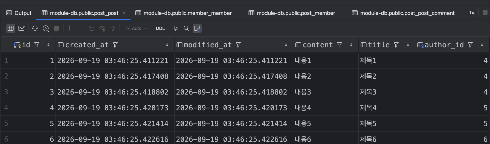
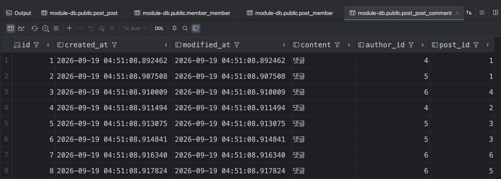

# programmers-module

프로그래머스 단기심화 과정 1부 과제입니다.

회원, 글, 댓글을 만들고 회원 모듈과 글 모듈을 분리했습니다. 하나의 Spring Boot 애플리케이션 안에서 실행하지만, 글 모듈이 회원 원본을 직접 가져다 쓰지 않도록 이벤트, HTTP API, 회원 복제본으로 연결했습니다.


## 1. 실행 방법

### 개발 환경

| 항목 | 설정 |
| --- | --- |
| JDK | 21 |
| 프레임워크 | Spring Boot 4.1.1, Spring Data JPA |
| 빌드 | Gradle Wrapper 사용 |
| DB | PostgreSQL 17, Docker Compose |
| 애플리케이션 포트 | 8888 |
| 실행 프로필 | dev |

Docker를 실행한 상태에서 아래 명령을 순서대로 실행합니다.

```bash
git clone https://github.com/heojungseok/programmers-module.git
cd programmers-module
docker compose up -d
```

DB 로그에 `database system is ready to accept connections`가 나오면 애플리케이션을 실행합니다.

```bash
docker compose logs db
./gradlew bootRun
```

`application.yml`에서 `dev` 프로필을 활성화했습니다. DB 연결, 서버 포트, SQL 로그 설정은 `application-dev.yml`에 있습니다. 테이블은 `ddl-auto: update`로 생성합니다.

### DB 접속 정보

| 항목 | 값 |
| --- | --- |
| Host / Port | localhost / 5432 |
| Database | module-db |
| Username | sa |
| Password | 없음 (`POSTGRES_HOST_AUTH_METHOD=trust`) |
| JDBC URL | jdbc:postgresql://localhost:5432/module-db |
| 컨테이너 | programmers-module-db |

학습용 로컬 설정으로 비밀번호 인증을 생략했습니다. Docker 포트는 `127.0.0.1:5432:5432`로 연결했습니다.

DB 데이터는 Docker 볼륨에 저장됩니다. `docker compose down`으로 컨테이너를 내려도 볼륨은 유지되므로, 다시 실행하면 같은 DB를 사용합니다.

## 2. 프로젝트 구조

```text
com.module
├── boundedContext
│   ├── member
│   │   ├── in       # 초기화, 이벤트 리스너, 보안 팁 API
│   │   ├── app      # MemberFacade, 가입·점수 변경 UseCase
│   │   ├── domain   # Member, MemberPolicy
│   │   └── out      # MemberRepository
│   └── post
│       ├── in       # 초기화, 회원 이벤트 리스너
│       ├── app      # PostFacade, PostWriteUseCase
│       ├── domain   # Post, PostComment, PostMember
│       └── out      # PostRepository, PostMemberRepository
├── shared
│   ├── member       # 회원 공통 기반 클래스, DTO, 이벤트, MemberApiClient
│   └── post         # 글·댓글 DTO와 이벤트
└── global           # 공통 엔티티 기반, 응답, 예외, 이벤트 발행
```

컨트롤러, 이벤트 리스너, 초기화 코드는 자기 모듈의 Facade를 호출합니다. 업무 트랜잭션도 Facade에서 관리합니다.

- **Facade**: 모듈의 진입점입니다. 트랜잭션을 시작하고 필요한 기능을 호출합니다.
- **UseCase**: 가입, 글 작성, 점수 변경처럼 기능을 실행하는 순서를 담당합니다. 엔티티 조회, 도메인 메서드 호출, 이벤트 발행을 연결합니다.
- **Entity**: 자신의 상태와 연관관계를 변경합니다. 점수 증가는 `Member.increaseActivityScore()`, 댓글 생성은 `Post.addComment()`에서 처리합니다.
- **Repository**: 해당 모듈의 데이터를 조회하고 저장합니다.

가입과 글 작성 결과는 `resultCode`, `msg`, `data`를 가진 `ResponseData<T>`로 반환합니다. 과제의 `RsData`와 같은 역할이며 클래스명은 `ResponseData`로 작성했습니다. 중복 username 가입은 `409-1` 코드의 `DomainException`으로 처리합니다.

## 3. 모듈 간 연결과 데이터 흐름

### 회원 가입과 복제

```text
MemberDataInit
 → MemberFacade: 회원 6명 가입을 하나의 트랜잭션으로 처리
 → MemberJoinUseCase: 회원 저장, MemberJoinedEvent 발행
 → 회원 가입 트랜잭션 커밋
 → PostEventListener
 → PostFacade.syncMember(): 별도 트랜잭션으로 PostMember 저장
```

이벤트에는 엔티티 대신 `MemberDto`를 담습니다. 복제하는 값은 ID, username, 닉네임, 활동점수, 생성 시각, 수정 시각입니다. 비밀번호와 비밀번호 해시는 전달하지 않습니다.

원본 회원은 ID와 시각을 생성하고, `PostMember`는 원본에서 받은 값을 그대로 저장합니다. 복제본에는 ID 자동 생성과 시각 자동 갱신을 적용하지 않았습니다.

회원 초기화는 `@Order(1)`, 글 초기화는 `@Order(2)`입니다. 현재 Spring 이벤트 처리는 별도 비동기 설정 없이 동작하므로, 회원 가입 후 복제본 저장을 마친 다음 글 초기화로 넘어갑니다. 글 초기화는 `PostFacade` 안에서 `PostMember`를 조회합니다.

### 글·댓글 작성과 활동점수

```text
PostFacade
 → PostWriteUseCase: 글 또는 댓글 생성, 작성 이벤트 발행
 → 작성 트랜잭션 커밋
 → MemberEventListener
 → MemberFacade: 별도 트랜잭션으로 활동점수 변경
 → MemberScoreUseCase: Member 상태 변경, flush, MemberModifiedEvent 발행
 → 점수 변경 트랜잭션 커밋
 → PostEventListener
 → PostFacade: 별도 트랜잭션으로 같은 ID의 PostMember 갱신
```

글 작성은 3점, 댓글 작성은 1점입니다. 기준값은 회원 모듈의 `MemberPolicy`에 뒀고, 가입 시 활동점수는 0으로 시작합니다.

리스너는 `@TransactionalEventListener(AFTER_COMMIT)`으로 커밋된 작성 이벤트를 처리합니다. 점수 변경과 복제본 저장은 Facade의 `REQUIRES_NEW`로 각각 별도 트랜잭션에서 실행합니다. 따라서 글이나 댓글 작성이 롤백되면 점수 변경도 실행되지 않습니다.

댓글은 `Post.addComment()`에서 생성하고 글의 댓글 목록에 추가합니다. `Post.comments`의 `cascade = PERSIST`를 통해 저장하므로 별도로 댓글 Repository의 `save()`를 호출하지 않습니다. 글과 댓글의 작성자는 모두 `PostMember`를 참조합니다.

### 이벤트와 HTTP API를 나눈 이유

가입이나 작성이 완료됐다는 사실을 다른 모듈에 전달할 때는 이벤트를 사용했습니다. 글 모듈은 회원 점수를 직접 수정하지 않고 작성 사실만 전달합니다. 회원 모듈이 점수를 변경한 뒤 다시 수정 이벤트를 보내 복제본에 반영합니다.

보안 팁은 글 작성 결과에 바로 포함해야 하는 조회 값이라 HTTP 응답을 받아 사용했습니다.

```text
PostWriteUseCase
 → MemberApiClient
 → GET http://localhost:8888/api/members/security-tip
 → ApiMemberController → MemberFacade → MemberPolicy
 → 보안 팁 응답을 글 작성 결과 메시지에 포함
```

같은 애플리케이션 안에 있어도 `MemberApiClient`의 `RestClient`로 실제 HTTP 요청을 보냅니다. 비밀번호 변경 주기 90일은 `MemberPolicy`에서 관리합니다.

## 4. 확인 결과

2026-09-19 로컬에서 확인한 결과입니다. DB 스크린샷과 SQL 조회 결과를 함께 기록했습니다.

### 4-1. 회원 원본 6명

`system`, `holding`, `admin`, `user1`, `user2`, `user3`을 실제 가입 기능으로 생성했습니다. 아래 스크린샷은 글과 댓글 작성에 따른 점수 반영까지 끝난 상태입니다. 비밀번호 `1234`는 초기 데이터용 값입니다.



### 4-2. 회원 복제본 6명

회원 원본과 같은 ID를 사용합니다. username, 닉네임, 활동점수, 생성 시각, 수정 시각이 동일하고 비밀번호 컬럼은 없습니다. 활동점수가 바뀐 뒤에도 복제본은 6행으로 유지됐습니다.



### 4-3. 글 6개

`user1`은 3개, `user2`는 2개, `user3`은 1개를 작성했습니다. 이 DB에서 각 회원의 ID는 4, 5, 6입니다. `author_id`는 글 모듈의 `post_member`를 참조합니다.



### 4-4. 댓글 8개

`user1`은 2개, `user2`와 `user3`은 각각 3개를 작성했습니다. `author_id`는 댓글 작성자, `post_id`는 댓글이 속한 글입니다.



### 4-5. 데이터 개수와 활동점수

SQL로 조회한 데이터 개수입니다.

```text
 members | replicas | posts | comments
---------+----------+-------+----------
       6 |        6 |     6 |        8
```

활동점수는 `글 수 × 3 + 댓글 수 × 1`로 계산한 값과 일치했습니다.

| 회원 | 글 수 | 댓글 수 | 계산한 점수 | 원본 점수 | 복제본 점수 |
| --- | ---: | ---: | ---: | ---: | ---: |
| system | 0 | 0 | 0 | 0 | 0 |
| holding | 0 | 0 | 0 | 0 | 0 |
| admin | 0 | 0 | 0 | 0 | 0 |
| user1 | 3 | 2 | 11 | 11 | 11 |
| user2 | 2 | 3 | 9 | 9 | 9 |
| user3 | 1 | 3 | 6 | 6 | 6 |

### 4-6. 원본과 복제본 일치

같은 ID의 회원을 기준으로 username, 닉네임, 활동점수, 생성·수정 시각을 비교한 결과 불일치는 0건이었습니다.

```sql
SELECT count(*) AS mismatched_members
FROM member_member m
FULL OUTER JOIN post_member r ON r.id = m.id
WHERE m.id IS NULL
   OR r.id IS NULL
   OR ROW(m.username, m.nickname, m.activity_score, m.created_at, m.modified_at)
      IS DISTINCT FROM
      ROW(r.username, r.nickname, r.activity_score, r.created_at, r.modified_at);
```

실제 조회 결과:

```text
 mismatched_members
--------------------
                  0
```

### 4-7. 같은 DB로 재실행

같은 DB로 애플리케이션을 재실행한 뒤 수동으로 확인했습니다. 데이터 개수와 점수 모두 동일했습니다.

| 확인 항목 | 재실행 전 | 재실행 후 |
| --- | --- | --- |
| 회원 / 복제본 | 6 / 6 | 6 / 6 |
| 글 / 댓글 | 6 / 8 | 6 / 8 |
| user1 / user2 / user3 점수 | 11 / 9 / 6 | 11 / 9 / 6 |

회원과 글은 데이터가 있으면 초기화를 건너뜁니다. 댓글은 첫 번째 글에 댓글이 있으면 생성을 건너뜁니다. 작성 기능을 다시 호출하지 않으므로 점수도 다시 증가하지 않았습니다.

작성 트랜잭션을 롤백했을 때 작성 데이터가 저장되지 않고 활동점수도 증가하지 않는 것을 수동으로 확인했습니다.

### 4-8. 보안 팁 HTTP 응답

애플리케이션 실행 후 아래 주소로 요청합니다.

```bash
curl -i http://localhost:8888/api/members/security-tip
```

구현 확인 시 받은 응답의 상태와 본문입니다.

```text
HTTP/1.1 200

비밀번호의 유효기간은 90일 입니다.
```

## 5. 강의와 다르게 선택한 부분

강의의 구조를 기준으로 만들되, 구현하면서 이해한 방향으로 일부를 바꿨습니다.

### 이벤트 발행은 UseCase에서 처리

강의는 `BaseEntity.publishEvent()`가 `GlobalConfig`를 통해 이벤트 발행기에 접근합니다. `Member`의 점수 변경과 `Post`의 댓글 생성 메서드에서 이벤트를 발행하는 구조입니다.

처음에는 공통 부모에 두면 편하겠다고 생각했는데, 엔티티가 전역 설정을 알아야 한다는 점이 걸렸습니다. 그래서 엔티티에는 상태 변경을 두고, UseCase에서 `EventPublisher`를 주입받아 DTO 생성과 발행을 처리했습니다. 점수 변경 흐름은 `MemberScoreUseCase`로 분리했습니다.

발행기는 `EventPublisher` 인터페이스와 `SpringEventPublisher` 구현체로 나눴습니다. 현재는 Spring 내부 이벤트를 사용하며 Kafka 연동은 구현하지 않았습니다.

### 비밀번호는 원본 Member에만 보관

강의의 `BaseMember`에는 비밀번호 필드가 있습니다. 이번에는 복제본에 필요 없는 값이고 과제에서도 복사를 금지하므로, 공통 부모에서 빼고 원본 `Member`에만 뒀습니다.

원본과 복제본의 컬럼이 완전히 같아야 하는 것은 아니라고 정리했습니다. 복제 대상 정보는 일치시키고, 글 모듈에 필요 없는 비밀번호는 DTO와 테이블 모두에서 제외했습니다.

### 초기화 트랜잭션은 Facade에서 관리

강의는 초기화 클래스가 자기 자신을 주입받아 트랜잭션 메서드를 호출합니다. 여기서는 `MemberDataInit`이 가입 정보 목록을 만들고 `MemberFacade.joinBaseMembersIfEmpty()`를 호출하도록 했습니다.

회원 6명 가입은 하나의 트랜잭션으로 묶었습니다. 중간 가입에서 예외가 발생하면 일부 회원만 남지 않고 함께 롤백됩니다. 초기화 클래스가 자기 자신을 주입받을 필요도 없어졌습니다.

## 6. 진행 중 막혔던 부분과 정리한 내용

### DataSource 설정을 읽지 못해 실행 실패

처음 실행할 때 다음 오류가 나왔습니다.

```text
Failed to configure a DataSource: 'url' attribute is not specified
Reason: Failed to determine a suitable driver class
```

처음에는 DB 실행 순서나 Docker의 `depends_on` 문제인지 생각했습니다. 그런데 이 메시지는 DB 접속 시도에 실패했다기보다 애플리케이션이 연결 설정을 찾지 못한 상태였습니다.

DB 설정을 둔 `application-dev.yml`과 활성 프로필을 확인하고, `application.yml`에서 `dev`를 활성화하는 구성으로 정리했습니다. 이후 PostgreSQL에 테이블이 생성되는 것을 확인했습니다.

### 자기 호출과 트랜잭션 경계

초기 데이터를 한 번에 넣으려면 자기 자신을 주입받아야 하는지 헷갈렸습니다. `this`로 호출하면 새로운 트랜잭션 어노테이션 처리를 거치지는 않지만, 외부에서 호출된 메서드가 이미 트랜잭션을 시작했다면 내부 작업도 그 트랜잭션 안에서 실행된다는 점을 정리했습니다.

현재는 초기화 클래스에서 Facade를 호출하고 Facade의 공개 메서드에 트랜잭션을 둡니다. UseCase는 그 안에서 작업합니다.

### 이벤트 DTO를 만드는 시점과 flush

회원 점수를 바꾼 직후 DTO를 만들면 JPA가 수정 시각을 갱신하기 전 값을 담을 수 있습니다. 그래서 점수 변경 후 `flush()`를 호출하고 `MemberDto`를 만들도록 했습니다. 댓글도 글과의 연관관계로 저장한 뒤 생성된 ID와 시각을 DTO에 담기 위해 발행 전에 flush합니다.

여기서 flush와 commit이 다르다는 점도 정리했습니다. flush는 변경 내용을 DB에 SQL로 반영하는 과정이고, 트랜잭션을 확정하는 것은 아닙니다. 커밋 전 예외가 발생하면 flush한 변경도 롤백될 수 있습니다.

반대로 `AFTER_COMMIT`에서 실행하는 점수 변경은 이미 끝난 작성 트랜잭션과 별개입니다. 점수 변경 중 오류가 나더라도 앞서 커밋된 글까지 함께 롤백되지는 않습니다.

## 7. 남겨둔 부분

- 댓글 초기화는 글 ID가 `1~6`인 것을 전제로 합니다. 새 DB에서 최초 생성하고 같은 DB로 재실행하는 흐름은 확인했지만, 글을 삭제한 뒤 시퀀스가 증가한 상태나 일부 초기 데이터만 남은 경우까지 복구하는 초기화는 아직 구현하지 않았습니다.
- `MemberApiClient`의 주소는 `localhost:8888`로 고정했습니다. 서버 포트를 바꾸면 클라이언트 주소도 함께 바꿔야 합니다.
- 점수 변경이나 복제본 저장이 커밋 후 실패했을 때 자동으로 재시도하는 기능은 없습니다.
